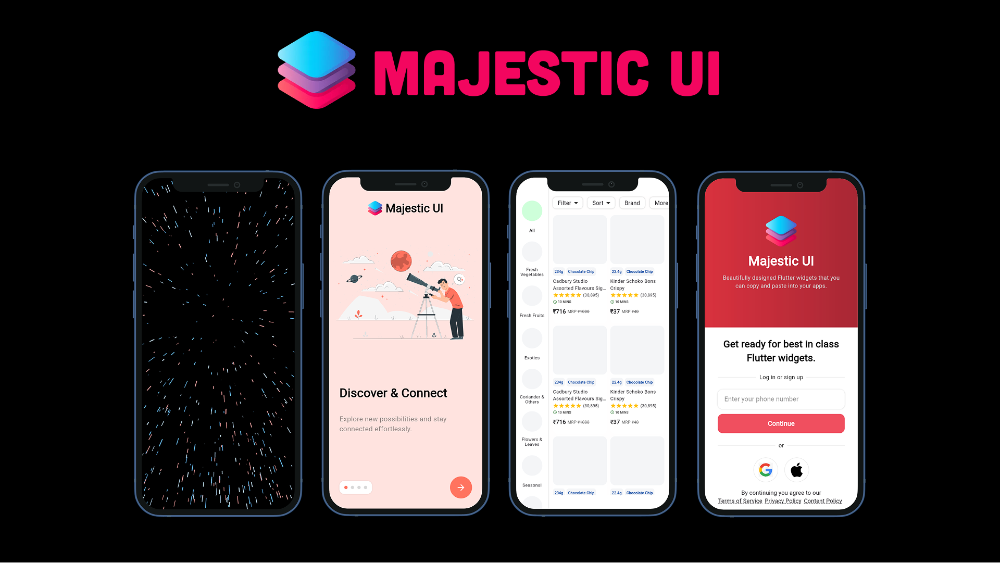

<a href="https://majesticui.com">
  <h1 align="center">
    <picture>
      <source width="" media="(prefers-color-scheme: dark)" srcset="assets/majestic-ui-long-logo.png">
      
    </picture>
  </h1>
</a>

<p align="center">
  <a href="https://www.youtube.com/watch?v=tYcU0XjLBHI"></a>&nbsp;
  <a href="https://discord.gg/Kze5FUa6fx"></a>
</p>

<p align="center">
  <a href="https://majesticui.com/installation">📚 Documentation</a> •
  <a href="https://majesticui.com/publish">📨 Publish</a>
</p>

<p align="center">
  Majestic UI is a Flutter UI library / collection of widgets that provides a set of beautifully designed Flutter widgets ready to copy and paste into your project.
</p>

<div align="center">
 
</div>

## Installation

### Add majestic_ui

```bash
dart pub global activate majestic_ui
```

### Add your first widget

```bash
majestic_ui add star_rush_background
```

Checkout the [documentation](https://majesticui.com/widgets/star_rush_background) for Star Rush Background.

## Contributing

Please read the [contributing guide](/CONTRIBUTING.md).

## License

To be added.
